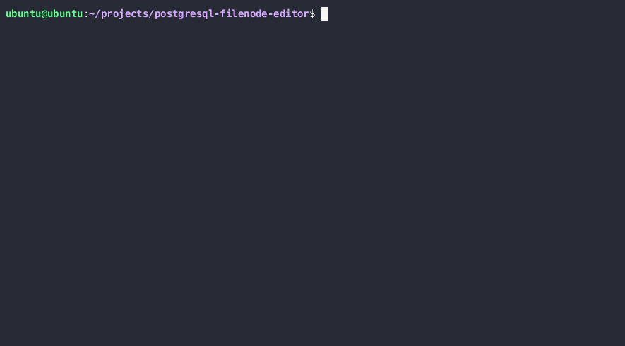

# PostgreSQL Filenode Editor
PostgreSQL Filenode Editor is tool that enables users to directly read and update data within PostgreSQL filenodes, the on-disk storage structure of PostgreSQL databases. 

Both raw and datatype-based parsing modes supported. However,the tool requires additional information, stored in a separate PostgreSQL table, to properly reinterpret row data to use the latter one.

The format of filenodes is described in great detail on [the following PostgreSQL documentation page](https://www.postgresql.org/docs/current/storage-file-layout.html).

Only regular (non-TOAST) tables are supported at this point.

## Setup
```
git clone https://github.com/adeadfed/postgresql-filenode-editor
cd postgresql-filenode-editor
python3 -m pip install -r requirements.txt
```

## Usage
### Obtaining filenode for a table
Filenodes are named with a PostgreSQL class ID of the related table. To obtain the filenode location and name of the target table, you can run the following SQL queries:
```sql
-- obtain PostgreSQL root data directory
SELECT setting FROM pg_settings WHERE name = 'data_directory';
-- obtain path to the target filenode, relative to the data directory
SELECT pg_relation_filepath('TABLE_NAME');
```

### Datatype-based parsing
To enable datatype-based parsing, you will need to extract type information, associated with the table, stored in the filenode, and supply it to the tool in a CSV format. 

You can use this query to get a correct CSV-formatted data:
```sql
SELECT
    STRING_AGG(
        CONCAT_WS(
            ',',
            attname,
            typname,
            attlen,
            attalign
        ),
        ';'
    )
FROM pg_attribute
    JOIN pg_type
        ON pg_attribute.atttypid = pg_type.oid
    JOIN pg_class
        ON pg_attribute.attrelid = pg_class.oid
WHERE pg_class.relname = 'TABLE_NAME';
```

All commands will now properly parse and present data in a human-readable format.


### Raw parsing
Without a proper datatype provided, the tool will only display raw data bytes. Editing in this mode is not does not guarantee stable results due to the missing information about NULL fields and their types.

Resulting filenodes may not be properly reinterpreted by the PostgreSQL servers.


#### Listing all items and pages
```bash
python3 postgresql_filenode_editor.py --filenode-path <PATH_TO_FILENODE> --mode list [--datatype-csv <OPTIONAL_DATATYPE_CSV>]
```

#### Listing all items in one page
```bash
python3 postgresql_filenode_editor.py --filenode-path <PATH_TO_FILENODE> --mode list --page 0 [--datatype-csv <OPTIONAL_DATATYPE_CSV>]
```

#### Reading single item
```bash
python3 postgresql_filenode_editor.py --filenode-path <PATH_TO_FILENODE> --mode read --page 0 --item 0 [--datatype-csv <OPTIONAL_DATATYPE_CSV>]
```

#### Updating single item (datatype)
```bash
python3 postgresql_filenode_editor.py --datatype-csv <DATATYPE_CSV> --filenode-path <PATH_TO_FILENODE> --mode update --page 0 --item 0 --csv-data <NEW_ITEM_DATA_CSV>
```

#### Updating single item (raw)
```bash
python3 postgresql_filenode_editor.py --filenode-path <PATH_TO_FILENODE> --mode raw_update --page 0 --item 0 --b64-data <NEW_ITEM_DATA_B64>
```